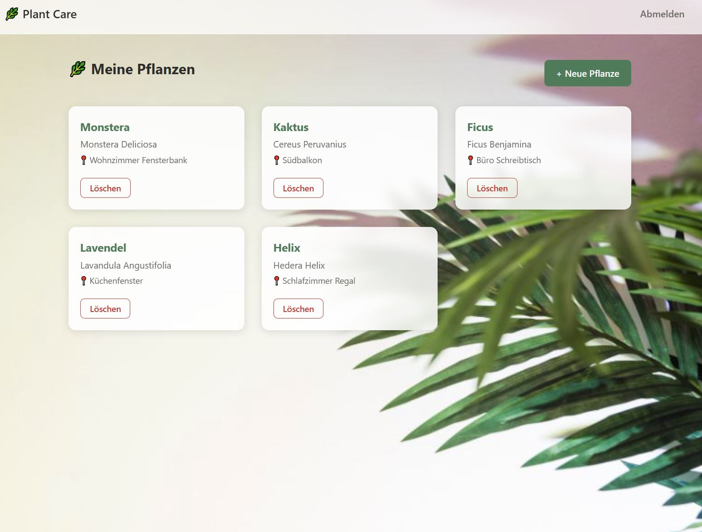
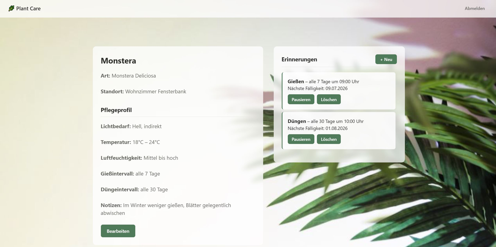
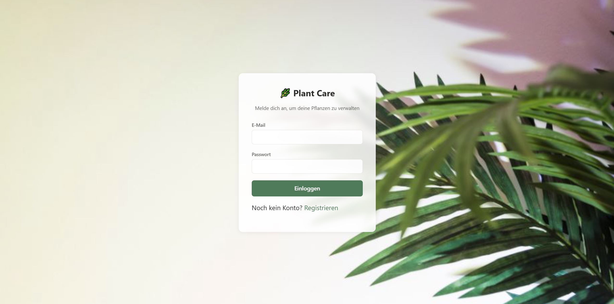
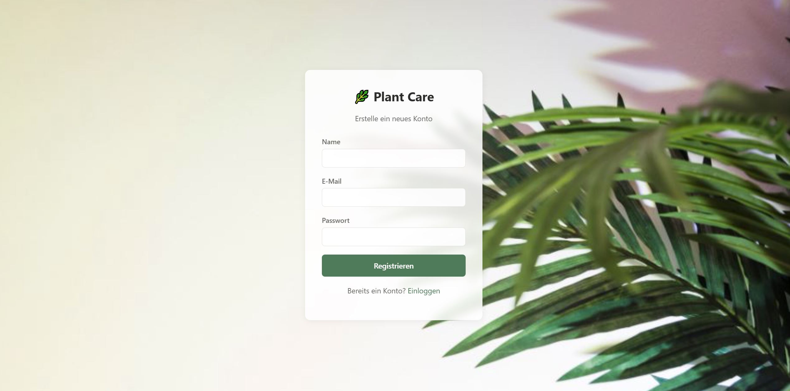
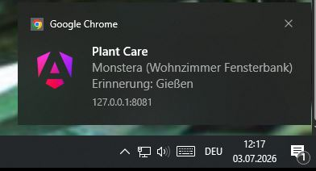

# 🌿 Plant Care App

Eine Fullstack-Webanwendung zur Verwaltung von Zimmerpflanzen mit Pflegeprofilen, wiederkehrenden Erinnerungen und echten Push-Benachrichtigungen.

> Portfolio-Projekt zur Demonstration von Fullstack-Entwicklung mit Java Spring Boot und Angular.

---

## Screenshots

| Pflanzenübersicht | Pflanzendetail mit Erinnerungen |
|---|---|
|  |  |

| Login | Registrierung |
|---|---|
|  |  |

| Push Nachricht                            |
|-------------------------------------------|
|  |
---

## Features

- **Account-System** — Registrierung und Login mit JWT-Authentifizierung
- **Pflanzen verwalten** — Pflanzen anlegen, bearbeiten, löschen
- **Pflegeprofile** — Lichtbedarf, Temperatur, Luftfeuchtigkeit, Gieß- und Düngeintervall pro Pflanze
- **Erinnerungen** — Wiederkehrende Gieß-/Dünge-/individuelle Erinnerungen mit frei wählbarem Intervall und Uhrzeit
- **Push-Benachrichtigungen** — Echte Browser-Push-Benachrichtigungen (auch bei geschlossenem Tab), ausgelöst durch einen serverseitigen Scheduler
- **PWA** — Nutzbar auf Smartphone und Desktop, läuft als Progressive Web App

---

## Technologie-Stack

### Backend
| Technologie | Zweck |
|---|---|
| Java 21 | Programmiersprache |
| Spring Boot 4 | Framework |
| Spring Security + JWT | Authentifizierung |
| Spring Data JPA + Hibernate | Datenbankzugriff |
| PostgreSQL | Datenbank |
| Spring Scheduler | Zeitgesteuerte Aufgaben |
| Web Push (VAPID) | Push-Benachrichtigungen |
| Docker Compose | Lokale Datenbankumgebung |
| JUnit 5 + Mockito + MockMvc | Unit- und Slice-Tests |

### Frontend
| Technologie | Zweck |
|---|---|
| Angular 22 | Framework |
| TypeScript | Programmiersprache |
| Angular Signals | Reaktives State-Management |
| Angular PWA / Service Worker | Push-Empfang, Offline-Fähigkeit |
| CSS Grid + Custom Properties | Responsives Styling |
| Vitest | Unit-Tests |

### Architektur
Das Backend folgt **Hexagonaler Architektur (Ports & Adapters)** mit klar getrennten Schichten:

```
ports/          ← Interfaces (Port In / Port Out)
domain/         ← Domain-Modelle und Services (Geschäftslogik)
persistence/    ← JPA-Entities, Repositories, DB-Adapter, Mapper
rest/           ← Controller, DTOs, Security
common/         ← Scheduler, geteilte Utilities
```

---

## Lokales Setup

### Voraussetzungen

- Java 21
- Maven
- Node.js 18+
- Docker Desktop

### 1. Repository klonen

```bash
git clone https://github.com/Bagin-w/plant-care-app.git
cd plant-care-app
```

### 2. Umgebungsvariablen setzen

Für das Backend werden folgende Umgebungsvariablen benötigt (z.B. in IntelliJ unter *Run → Edit Configurations → Environment variables*):

| Variable | Beschreibung |
|---|---|
| `JWT_SECRET` | Mindestens 32 Zeichen langer geheimer Schlüssel |
| `VAPID_PUBLIC_KEY` | Öffentlicher VAPID-Key (generiert mit `npx web-push generate-vapid-keys`) |
| `VAPID_PRIVATE_KEY` | Privater VAPID-Key |
| `E_MAIL` | Kontakt-E-Mail-Adresse für den VAPID-Subject-Claim (`mailto:...`) |

### 3. Datenbank starten

```bash
docker compose up -d
```

### 4. Backend starten

```bash
cd backend
mvn spring-boot:run
```

Das Backend läuft auf `http://localhost:8080`.

### 5. Frontend starten (Entwicklungsmodus)

```bash
cd frontend
npm install
ng serve
```

Das Frontend läuft auf `http://localhost:4200`.

### 6. Frontend mit Push-Benachrichtigungen testen (Production-Build)

Push-Benachrichtigungen funktionieren nur im Production-Build (nicht bei `ng serve`):

```bash
cd frontend
ng build
cd dist/frontend/browser
npx http-server -p 8081 -a 127.0.0.1
```

Öffne `http://localhost:8081` im Browser.

---

## Tests

### Backend

```bash
cd backend
mvn test
```

Abgedeckt sind die Domain-Service-Schicht (Geschäftslogik, Eigentümer-Prüfung, Validierung — JUnit 5 + Mockito), die REST-Controller (`@WebMvcTest` + MockMvc, inkl. JWT-Authentifizierung und Fehlerverhalten) sowie die Mapping-Logik zwischen Domain-Modellen und JPA-Entities. Nicht abgedeckt ist die Persistenz-Schicht selbst (Repository-Queries, Adapter) — dafür wäre ein Integrationstest gegen eine echte Datenbank (z.B. via Testcontainers) nötig, den es aktuell noch nicht gibt. Der Standard-`@SpringBootTest`-Smoketest (`PlantCareAppApplicationTests`) benötigt eine laufende PostgreSQL-Instanz (`docker compose up -d`).

### Frontend

```bash
cd frontend
ng test
```

Abgedeckt sind die Auth-Kette (Login, Registrierung, HTTP-Interceptor, Route-Guard), alle HTTP-Services sowie die Feature-Komponenten (Pflanzen anlegen/bearbeiten/löschen, Pflegeprofil, Erinnerungen) mit gemockten Backend-Aufrufen. Der Test-Runner ist Vitest (über den `@angular/build:unit-test`-Builder), nicht Karma/Jasmine.

---

## API-Übersicht

| Methode | Endpunkt | Beschreibung |
|---|---|---|
| `POST` | `/api/users` | Registrierung |
| `GET` | `/api/users/{id}` | Nutzer abrufen |
| `POST` | `/api/auth/login` | Login → JWT |
| `GET` | `/api/plants` | Alle Pflanzen des Users |
| `POST` | `/api/plants` | Neue Pflanze anlegen |
| `PUT` | `/api/plants/{id}` | Pflanze bearbeiten |
| `DELETE` | `/api/plants/{id}` | Pflanze löschen |
| `GET` | `/api/plants/{id}/care-profile` | Pflegeprofil abrufen |
| `PUT` | `/api/plants/{id}/care-profile` | Pflegeprofil bearbeiten |
| `GET` | `/api/plants/{id}/reminders` | Erinnerungen abrufen |
| `POST` | `/api/plants/{id}/reminders` | Erinnerung anlegen |
| `PATCH` | `/api/reminders/{id}/activate` | Erinnerung aktivieren |
| `PATCH` | `/api/reminders/{id}/deactivate` | Erinnerung pausieren |
| `DELETE` | `/api/reminders/{id}` | Erinnerung löschen |
| `POST` | `/api/devices` | Gerät für Push registrieren |

---

## Architektur-Highlights

### JWT-Authentifizierung
Jeder Request (außer Login/Registrierung) wird durch einen `JwtAuthFilter` geprüft, der das Token aus dem `Authorization`-Header validiert und die `userId` in den Spring-Security-Kontext einträgt. Controller greifen darauf per `@AuthenticationPrincipal` zu — kein manuelles Token-Parsen in der Geschäftslogik.

### Eigentümer-Prüfung
Pflanzen, Pflegeprofile und Erinnerungen sind immer an einen User gebunden. Jeder betroffene Service prüft vor dem Zugriff über eine private `assertOwnership`-/`assertPlantOwnership`-Methode, dass der anfragende User tatsächlich der Besitzer der angefragten Pflanze ist (verhindert IDOR-Schwachstellen).

### Scheduler + Push
Ein Spring `@Scheduled`-Job (aktuell alle 10 Sekunden für einfaches lokales Testen, produktiv über die Cron-Expression frei konfigurierbar) vergleicht alle aktiven Erinnerungen gegen `LocalDateTime.now()`. Fällige Regeln lösen Web-Push-Nachrichten (VAPID-signiert) an alle registrierten Geräte des jeweiligen Users aus. Nach dem Auslösen werden `lastTriggeredAt` und `nextDueAt` (verschoben um das konfigurierte Intervall in Tagen) aktualisiert.

### Zoneless Angular
Das Frontend nutzt Angulars **zoneless Change Detection**-System (`provideZonelessChangeDetection()`). Alle asynchron geladenen Daten (API-Calls) werden über **Signals** (`signal<T>()`) verwaltet, damit Angular Änderungen zuverlässig erkennt und die UI aktualisiert.

---

## Hinweise

- Der JWT-Secret und die VAPID-Keys müssen **niemals** in das Repository eingecheckt werden
- Der Scheduler löst Erinnerungen **tagesgenau zur konfigurierten Uhrzeit** aus — abhängig vom Cron-Intervall innerhalb des entsprechenden Zeitfensters
